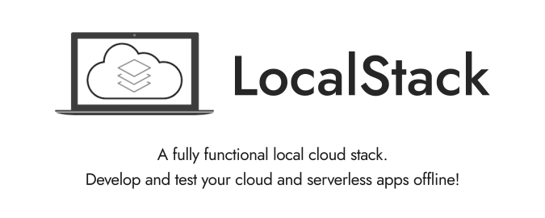

# Localstack AWS CLI
---

- Description: This is a simulated AWS setup that can be used for Testing.

- Localstack Repo: [Localstack](https://github.com/localstack/localstack)



## Repo Structure
---
```
.
├── awscli-commands.md
├── aws-services
│   ├── dynamodb
│   │   ├── create-table.sh
│   │   ├── describe-table.sh
│   │   ├── list-tables.sh
│   │   └── scan-table.sh
│   ├── iam
│   │   ├── attach-role-policy.sh
│   │   ├── create-role.sh
│   │   └── ddb-access.json
│   ├── lambda
│   │   ├── create-event-source-mapping.sh
│   │   ├── create-function.sh
│   │   └── list-functions.sh
│   └── utils.sh
├── container
│   ├── cleanup.sh
│   ├── get-container-logs.sh
│   ├── ssh-container.sh
│   ├── start.sh
│   └── version.sh
├── docker-commands.md
├── env-vars.set.sh
├── env-vars.unset.sh
├── example
│   ├── ddbstreams-lambda-rmq.sh
│   ├── start-lambda-log.py
│   └── stop-lambda-log.sh
├── README.md
├── setup
│   ├── check-internet.sh
│   ├── formatting.sh
│   ├── images-handler.sh
│   ├── package.sh
│   └── setup.sh
└── static
    └── localstack.png
```

## First Time Installation
---

- clone the repo

- To setup the Environment go to folder [setup](/setup) and execute `setup.sh`
```bash
sudo bash setup.sh
```

- [sample output](/sample.txt)

- set 2 environment variables in each terminal being used-
```
container_name="<write container name here>"
host_port="<write port number here>"
```

- This can be done by setting the values in file [env-vars.set.sh](/env-vars.set.sh) and sourcing the file in each terminal.
```bash
source env-vars.set.sh
```

- *`(optional)` The environment variables can be unset as well using [env-vars.unset.sh](/env-vars.unset.sh)*
```bash
source env-vars.unset.sh
```

- Once Environment is setup, we need to configure the `aws-cli`. Provide random entries interactively and make sure to keep `output format` as `json`
```bash
aws configure
```
```bash
AWS Access Key ID [None]: temp
AWS Secret Access Key [None]: temp
Default region name [None]: temp
Default output format [None]: json
```

- To use aws-cli commands use `AWS` instead of `aws` where
```bash
alias AWS="aws --endpoint-url http://localhost:$host_port"
```
where `$host_port` is endpoint for Localstack container `$container_name`

`NOTE`: `AWS` command will be set as part of [env-vars.set.sh](/env-vars.set.sh) itself.

#### *Persistent Environment Variables (Optional)*
---
- Open `~/.bashrc` using
```bash
sudo vi ~/.bashrc
```

- Add / update these 2 lines in `~/.bashrc`
```bash
export container_name="<write container name here>"
export host_port="<write port number here>"
```

- source the updated `~/.bashrc` file to access the variables
```bash
source ~/.bashrc
```

## Handling Localstack containers
---

#### Create container

go to folder [container](/container) and then execute the script
```bash
bash start.sh
```
`NOTE`: make sure the environment variables are set.

#### Get Logs from container

```bash
bash get-container-logs.sh
```

#### SSH to container

```bash
bash ssh-container.sh
```

#### Delete the container

```bash
bash cleanup.sh
```

## Custom AWS Projects for Example
---
User can Automate the setup for their own projects.
One such example is in folder [example](/example)

#### [example](/example)

- To run the example project go to [example](/example) and execute [ddbstreams-lambda-rmq.sh](/example/ddbstreams-lambda-rmq.sh)
```bash
bash ddbstreams-lambda-rmq.sh
```

- To read log of the lambda function execute [start-lambda-log.py](/example/start-lambda-log.py) [strictly non-sudo] (*might fail*)
```bash
python3 start-lambda-log.py
```

- To stop reading log of the lambda function execute [start-lambda-log.py](/example/stop-lambda-log.sh)
```bash
bash stop-lambda-log.sh
```

## Issues
---
#### `docker ps` not working without `sudo`
---
- Add user to `docker` group
```bash
sudo usermod -aG docker $USER
```

- if still does now work, switch as the `username` again.
```bash
sudo su -l <username>
```

- now docker commands without sudo will work
